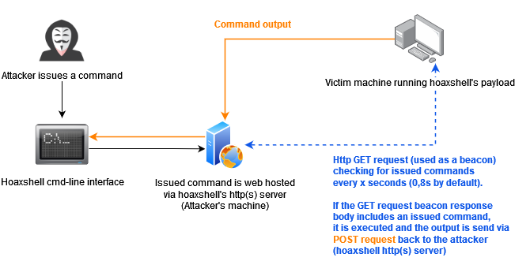
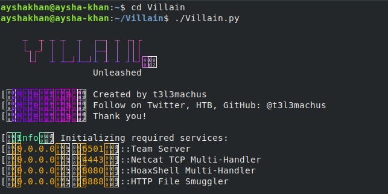
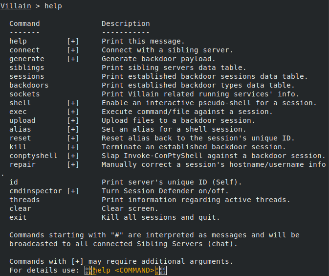
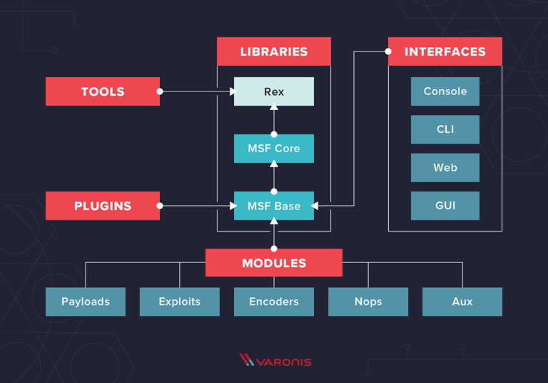
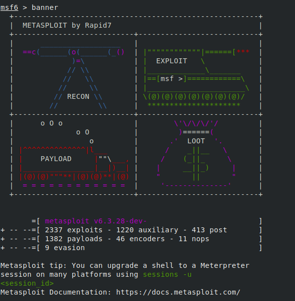
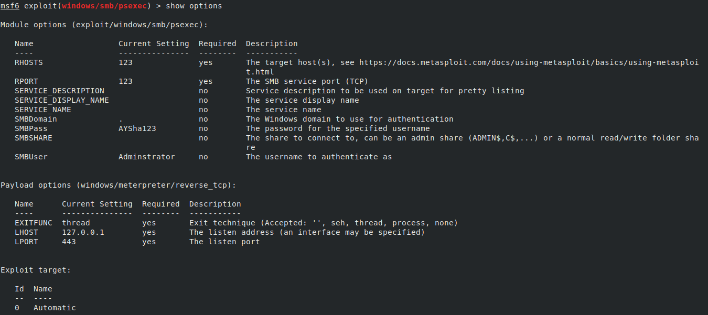
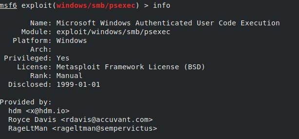
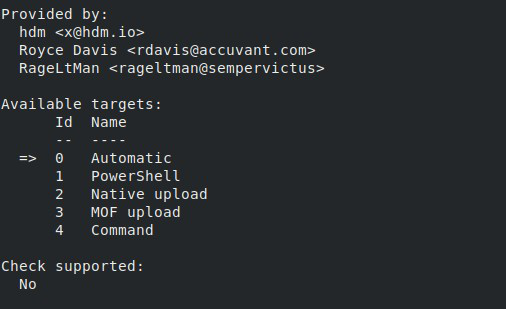
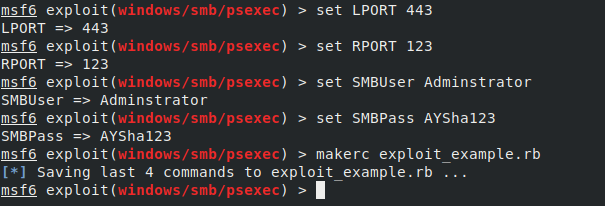
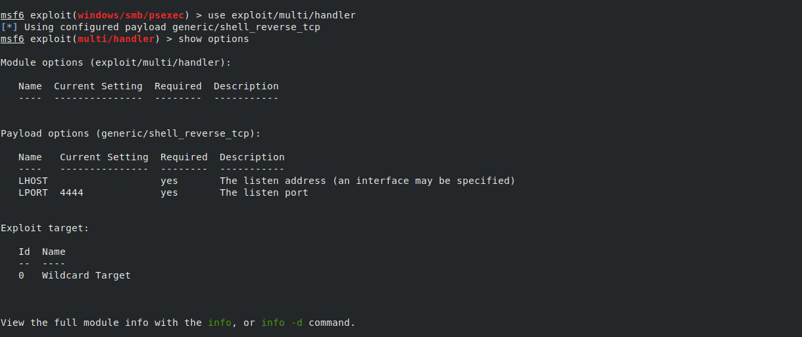

# PROJECT-II

 **Aim**: The aim of this project is to comprehensively assess the
 capabilities, risks, and implications of offensive cybersecurity
 tools, with a focus on Villain and Metasploit. The project aims to
 provide insights into their potential applications, vulnerabilities
 they exploit, and the ethical and security
 considerations surrounding their use.

# Tool_I 

# Villain

 About **Villain:**

 In this project, I explored **Villain**, a C2 framework that advances the idea behind handling multiple TCP 
 sockets and HoaxShell-based reverse shells to new heights.

 It allows users to generate powerful and customizable payloads for
 their specific requirements.

 Villain's user-friendly design and intuitive interface make creating
 backdoors and managing numerous sessions a breeze. Additionally,
 Villain is compatible with Windows and Linux machines, making it an
 ideal cross-platform solution. If you want to enhance your backdoor
 generation and session management skills for ethical hacking and
 penetration testing, Villain is an exceptional tool worth exploring.

 Villain Tool Preview:

 **Key commands of Villain{.underline}**:

 <--Generate Backdoor Payloads-->

 Connect with Sibling Server\
 The shell command\
 The Upload Command\
 The Conptyshell Command\
 The exec Command*\
 Chat with Sibling Servers\
 Session Defender

 Use \<help\> command to display all Commands which are used in
 Villain:

 In this Poject will go with some basics commands which are used by
 Villain to generate Reverse Shell/Backdoor Payloads\....

 Generate Reverse Shell Commands

 Use the generate prompt command to generate payloads for\
 Windows / Linux machines. In the latest Villain release, this function
 was redesigned to use payload templates (files). In\
Core/payload_templates/\<OS\>/\<HANDLER\>/ you can find these\
 templates, edit them, make your own, etc. Ultimately, you should
 replace the predefined Windows reverse shell commands with obfuscated
 versions. That way you can create a personalized instance of Villain
 and deal with AV evasion in a more productive and efficient way.

 To get the syntax of the generate command type \<help generate\>\.....

 Generate payload by using the following syntax:

 Syntax:

 Generate payload=\<OS_TYPE/HANDLER/PAYLOAD_TEMPLATE\> lhost=\<IP or
 INTERFACE\> \[ obfuscate encode \]

 

 Use the \<connect\> prompt command to connect and share your shell
 sessions with another machine running Villain.

 By default, the Core server port is 65001 (you can change that with -p
 when starting Villain).

Sessions Command:\
Use sessions command to show active session in the victims computer\...

Shell command:\
Use the \<shell\>prompt command to start an interactive pseudo-shell for
a shell session. The effectiveness of the pseudo shell is going to vary
depending on the quality and stability of the shell session. Again, you
should prefer TCP socket based shells as they will always be more stable
than HoaxShell.

Now we are on this machine that the little thing at the bottom so we are
on this machine right now,so we can just type windows command like for
Example\
\<who am i\>

 and you can type \<systeminfo\> to see if we get to pull the info for
 that Machine..

 one can also use the \<exec\> prompt command to execute a quoted
 command or script from your file system against a session. Files are
 executed by being http requested from the Http File Smuggler. Be
 carefull! The script you execute should much the shell session type
 (e.g., a PowerShell script script should be executed against a
 powershell.exe session, etc).

 One can use \<exit\> to exit from the machine but the session still
 active\...

To Terminate the session use \<kill\> command with the session ID\...

 If you type \<sessions\> after the \<kill\> command there is no active
 sessions\....

 **Conclusions**

 Villain has a built-in auto-obfuscate payload function to assist users
 in bypassing AV solutions (for Windows payloads). As a result,
 payloads are undetected (for the time being).

 Each generated payload is going to work only once. An already used
 payload cannot be reused to establish a session.

 The communication between sibling servers is AES
encrypted using the recipient sibling server's ID as the
 encryption KEY and the 16 first bytes of the local server's ID as IV.
 During the initial connection handshake of two sibling servers, each
 server's ID is exchanged clear text, meaning that the handshake could
 be captured and used to decrypt traffic between sibling servers. I
 know it's "weak" that way. It's not supposed to be super secure as
 this tool was designed to be used during penetration testing / red
 team assessments, for which this encryption schema should be enough.

Villain instances connected with each other (sibling servers) must be
able to directly reach each other as well. I intend to add a network
route mapping utility so that sibling servers can use one another as a
proxy to achieve cross network communication between them.

# Tool_II

# METASPLOIT-FRAMEWORK

 About **METASPLOIT**:

 The Metasploit framework is a very powerful tool which can be

 used by cybercriminals as well as ethical hackers to probe systematic
 vulnerabilities on networks and servers. Because it's an open-source
 framework, it can be easily customized and used with most operating
 systems.

With Metasploit, the Pen Testing Team can use ready-made or custom
 code and introduce it into a network to probe for weak spots. As
 another flavor of threat hunting, once flaws are identified and
 documented, the information can be used to address systemic weaknesses
 and prioritize solutions.

 **Here's a diagram of a typical Metasploit architecture:**

 **PREVIEW OF METASPLOIT:**

 

 **BASIC COMMANDS USED IN METASPLOIT**\
 One shortcut is to type "help" into the console, which will bring up a
 list of Metasploit commands and their descriptions. It should look
 like this:

 Type "use exploits/windows/smb/psexec" thats it now we are in psexec
 module and now I've gone ahead and set some commands\...

 \<show options\>

 

 

\<set PAYLOAD \> for windows:

 

 \<set LHOST\>

 

 \<set LPORT\>

 

 \<set RPORT\>

 
 
 \<set RHOST\>

 

 again type \<show options\> to see the difference:

 To see sessions type \<sessions\>
 

 To get the all information about the machine type \<info\>

 

 Use \<save \>to save all commands use by the metasploit\...

 

 use \<cat file_name\> to see the contents of the file msf4

 

 \<makerc file_name\> to save all used commands in a particular
 file_name(exploit_example.rb)

 use \<cat file_name\> to see the contents of the exploit_example.rb

 

To see jobs and sessions :\
\<jobs\> to see active jobs(since there is no active jobs here)\
\<sessions\> to see active sessions (since there is no active sessions)

 

To change the module again we have to type the \<use module_name\>
command\....

 

 \<search \> command

 use \<exit\> command to exit from Metasploit

 

 **Conclusions**

 With the wide range of applications and open-source availability that

 Metasploit offers, the framework is used by professionals in
 development,

 security, and operations to hackers. The framework is popular with
 hackers and

 easily available, making it an easy to install, reliable tool for
 security

 professionals to be familiar with even if they don't need to use it.

 

**Thank you**

