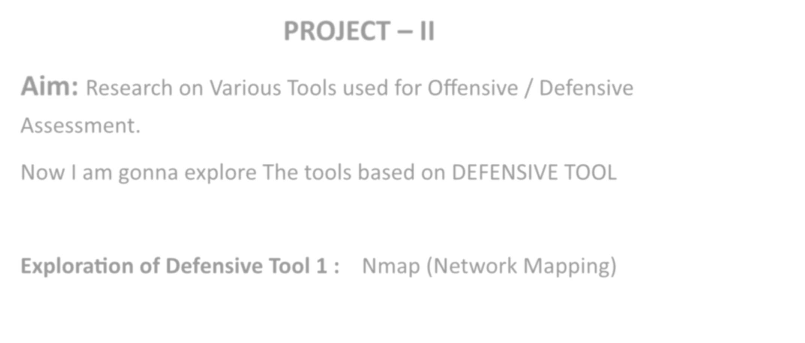
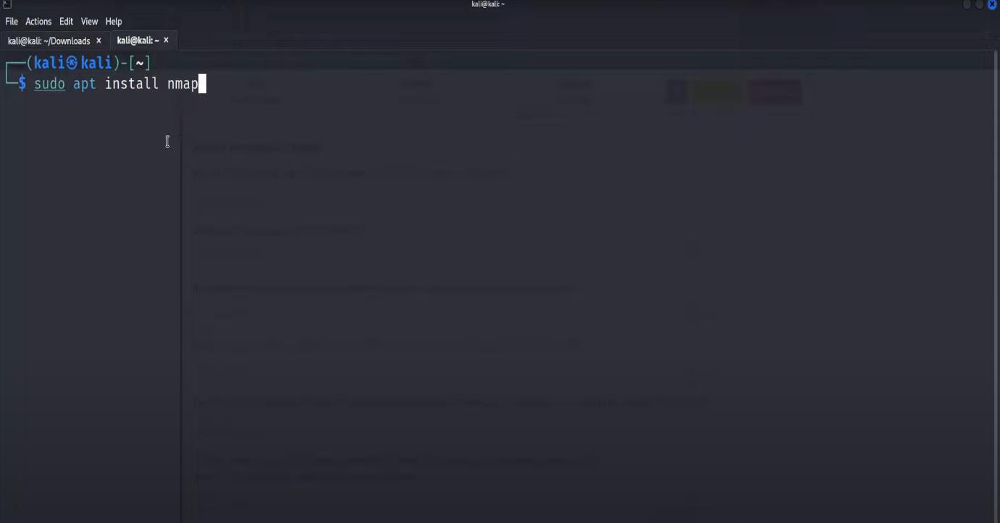
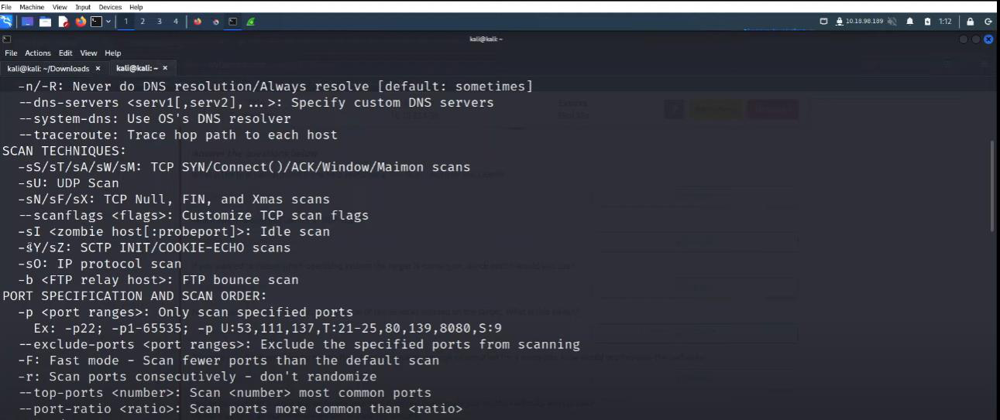
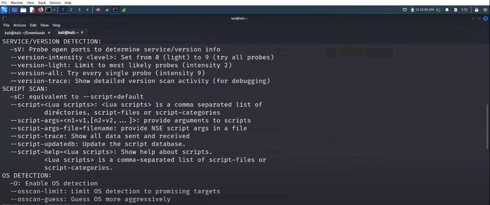
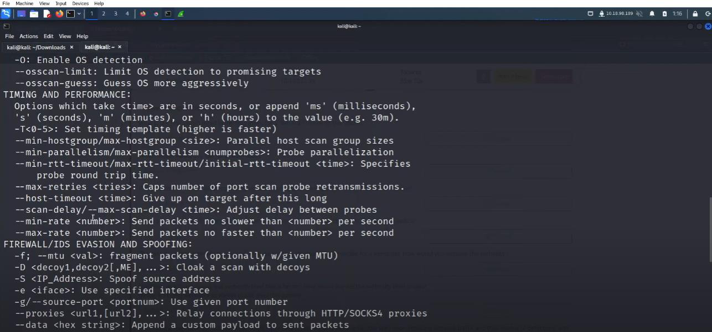
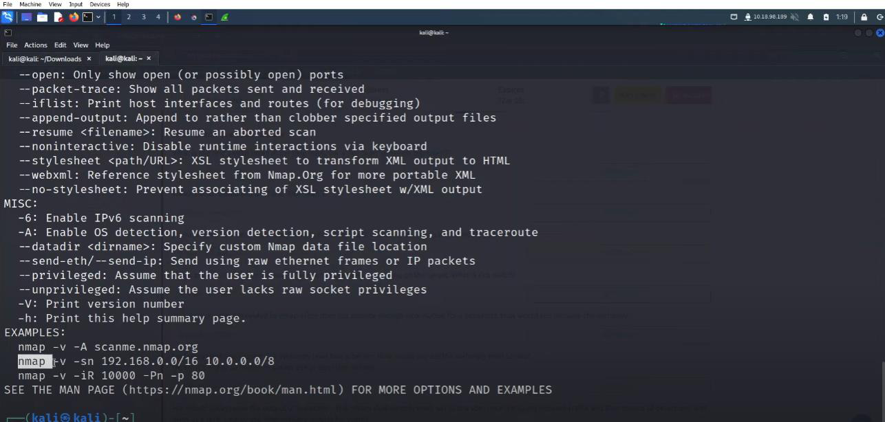
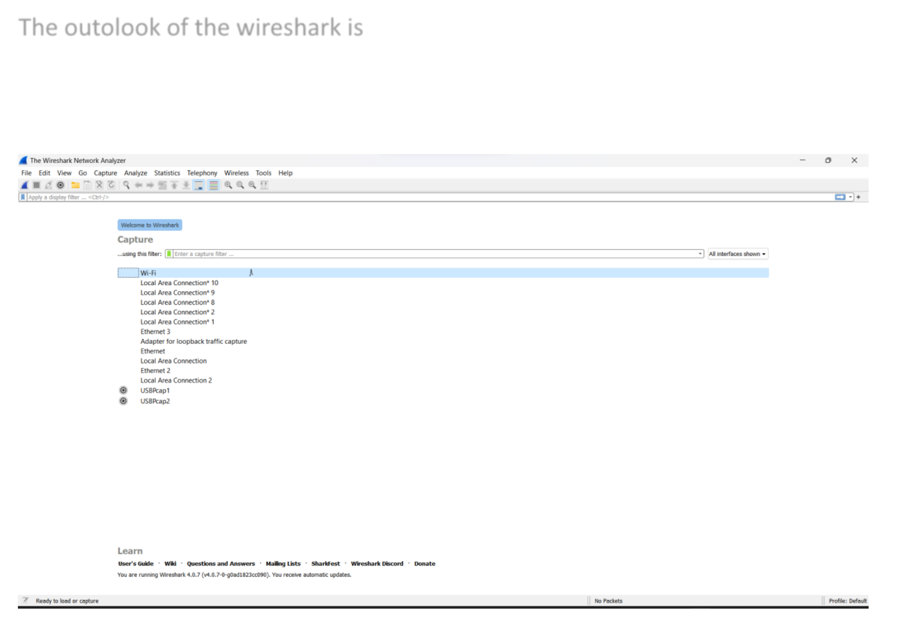
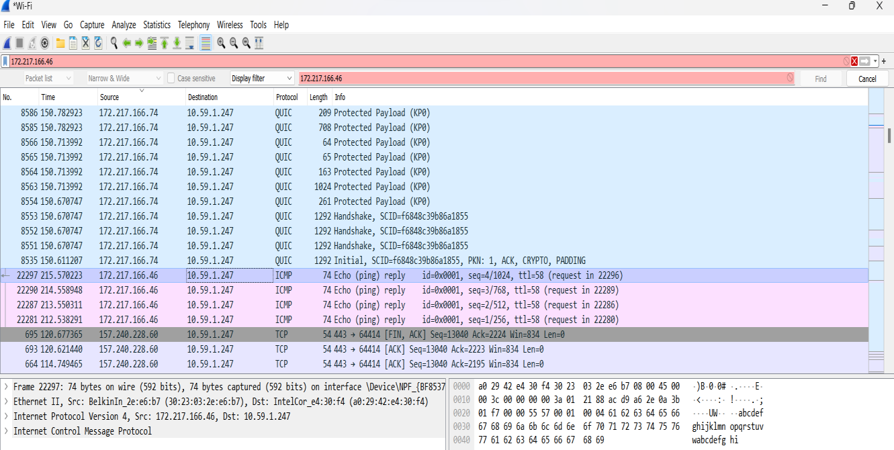
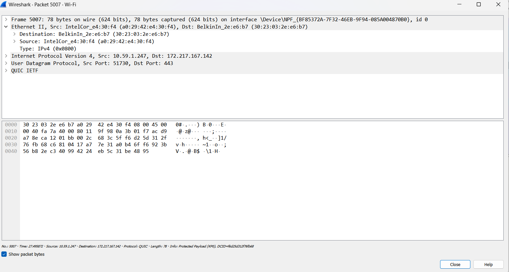
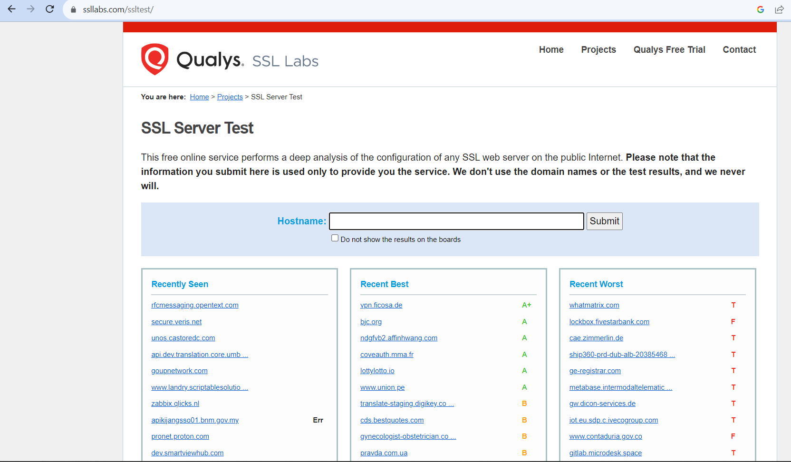

{width="7.463888888888889in"
height="3.191360454943132in"}{width="0.3111111111111111in"
height="0.43950568678915136in"}{width="0.38055555555555554in"
height="0.43986329833770776in"}

**PROJECT -- II**

**Aim:** Research on Various Tools used for Offensive / Defensive

Assessment.

Now I am gonna explore The tools based on DEFENSIVE TOOL

**Exploration of Defensive Tool 1 :** Nmap (Network Mapping)

Before, Entering the concept of Nmap. We need to have an idea on the
Ports. single physical network connection to handle many incoming and
outgoing requests by assigning a port number to each. The numbers go
from 0 to 65535.

> In this the Ports are divided into categories,
>
> 0 - 1023 = Well - known Ports\
> 1,024 - 49,151 = Registered Ports\
> 49,152 - 65,535 = Dynamic Ports (or) Private Ports

When a client try to access the particular the server then that
particular server connect a certain port. So by using this nmap tool now
we can know to which that server is connect to which particular port and
also the host can be found.

NMAP:

As told above by Network Mapping we can find the to which host it is
coonect and to which port the server is connect , Event the ack packet
scanned in the backed is the packet sent or not. Which service is used
for that particular server is also know by using Nmap. Which operating
system is used in that particular server is also found by using Nmap.

{width="1.4083333333333334in"
height="0.4444739720034996in"}

InstallatIon of nmap In kalI lInux :\
To install nmap open terminal in the kali linux. Write a command as
shown in the below picture.

{width="6.266666666666667in"
height="3.2875in"}

> Command: sudo apt install nmap

Exploration of N-Map Tool:\
To know about the commands in nmap tool we need to use the command

> **nmap \--help**

by using the help command we get as below

{width="6.268054461942257in"
height="3.65in"}

{width="6.268054461942257in"
height="3.683333333333333in"}

{width="6.268054461942257in"
height="3.4833333333333334in"}

{width="6.268054461942257in"
height="3.675in"}

{width="6.268054461942257in"
height="4.0in"}

{width="6.268054461942257in"
height="3.9583333333333335in"}

By using man nmap the entire manual for the entire nmap will be shown in
the terminal.

> By -A we can do aggressive scanning.

To scan particular port the command will be -p portnumber\
Example: -p443\
To scan the port range then the command will be -p portnumber --
portnumber Example: -p 1235 -- 3500\
To scan all the ports we use the command -p-

Above shown commands are basic commands which are commonly used to
explore the remaining commands just go with the above given pictures.

In port scanning we have types they are:

> TCP Connect Scans (-sT)\
> SYN \"Half-open\" Scans (-sS)\
> UDP Scans (-sU)\
> TCP Null Scans (-sN)\
> TCP FIN Scans (-sF)\
> TCP Xmas Scans (-sX)

To port scan a Domain we need to use their respected website ip address
by using the command\
Nmap -p- \<ipaddress\>\
Here now I am gonna give the ip address of greek of greek then the
output will be as shown in the figure.

{width="6.268054461942257in"
height="1.8in"}

When give the command the scanning of ports takes some time after some
time the above picture is the output. Here the report shows how many
ports are used in that particular site and what is the state like are
the ports are open or in closed state. Service shows the data like
domain and the connections of the that ports.

So, I think I have given the basic exploration of the nmap tool. But
still there a lot to explore the tools to explore we use their main
source to learn\
/ in this we can learn in deep.

{width="4.516666666666667in"
height="0.9435739282589676in"}{width="6.651388888888889in"
height="4.677136920384952in"}

> **Exploration of Defensive Tool 2 :** Wireshark
>
> Wireshark is a network packet analyzer. A network packet analyzer
> presents
>
> captured packet data in as much detail as possible.
>
> The following are some of the many features Wireshark provides:
>
> •Available for LINUX and WINDOWS.
>
> •*Capture* live packet data from a network interface.
>
> •*Open* files containing packet data captured with tcpdump, Wireshark,
> and many other packet capture programs.
>
> •Display packets with *very detailed protocol information*.
>
> •*Save* packet data captured.
>
> •*Export* some or all packets in a number of capture file formats.
> •*Filter packets* on many criteria.
>
> ...and *a lot more!*
>
> The outolook of the wireshark is

To start the capturing of the packets we need to click the blue shark
symbol as

shown in the below picture

{width="6.083333333333333in"
height="1.0166655730533682in"}

After starting the capture of the packets we see as the below shown
picture

I have played an video in youtube

{width="6.268054461942257in"
height="4.381944444444445in"}

After this when we see the wire shark the packets captured is shown as
in the below picture

{width="6.656943350831146in"
height="3.0444444444444443in"}

So to capture the particular packet then we should stop the capturing
like shown in the below.

{width="5.2875in"
height="0.2833333333333333in"}

By clicking the red button the capturing stops

{width="4.726388888888889in"
height="1.1513877952755907in"}

This is the ip of the youtube ip address which is shown.

{width="6.268054461942257in"
height="2.636111111111111in"}

The main advantage of the wireshark is we can see the protocol which is
used to communicate with each other source is the ip of the website
which we need to connect and Destination is our IP address.

Info : In this we can see from where the request is sent.

In my scenario when I have tried to capture I have even seen the redmi
is sending the request with no related to my system so by using this
application we can clearly see where the request is sent and received.

Time: This the time taken for the request.

By clicking our ip address we get this data as pop up

{width="6.268054461942257in"
height="3.3611100174978126in"}

In this we can what type of protocol is used, how ports are connected
and also which type of ethernet we are using is also shown in that pop.

So, this is the basic exploration of the wireshark to explore more we
can go the their official site as this helps us to explore more their
tool

Main aim for using the wireshark is to track the packets. Where it is
sent and from it is requested and also its shows us the PROTOCOL
connection is used whether the tcp / tls / http etc.. everything is
shown here.

{width="4.386111111111111in"
height="0.9438462379702537in"}

**Exploration of Defensive Tool 3 :** SSL LABS

This is mainly used the verify the certificates SSL certificates are
what enable websites to use HTTPS, which is more secure than HTTP. An
SSL certificate is a data file hosted in a website\'s origin server. SSL
certificates make SSL/TLS encryption possible, and they contain the
website\'s public key and the website\'s identity, along with related
information.

The outlook of the website be like

{width="6.268054461942257in"
height="3.661110017497813in"}

After Entering the Site name in the HOST NAME :

1st : GOOGLE.COM the result will be shown as below picture

{width="6.268054461942257in"
height="3.2569444444444446in"}

Here the grade is "B" which Average secure normally the best grade is
'A+' by

going the to the below we can see the protocol security that is been
giving to

the site.

{width="6.268054461942257in"
height="1.9513888888888888in"}

2nd Site: the unkown site

{width="6.268054461942257in"
height="1.9097222222222223in"}

Here the grade is C this means the site is very less secure in the
security.

{width="6.268054461942257in"
height="1.8847211286089238in"}

The protocols are also shown that this is very less secure.

This site also shows the Cipher Text of that site is also shown whether
it is strong or not

{width="6.268054461942257in"
height="3.747221128608924in"}

{width="3.679165573053368in"
height="1.1963353018372704in"}{width="1.625in"
height="0.3055555555555556in"}{width="1.601388888888889in"
height="0.2893471128608924in"}{width="2.125in"
height="0.2222222222222222in"}{width="2.1041666666666665in"
height="0.20991688538932635in"}

By using this tool we can know the security level of the site we are
developing or using by that we can update the security level of the site
so that we can secure the data of the user and also the organisations by
upgrading the security levels.

Done by:

Anand Revanth Kumar
